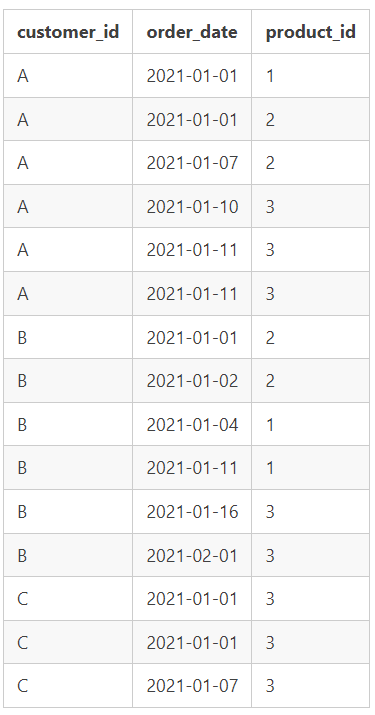

# Danny's Diner
Danny's Diner is the first week project for the  #8WeekSQLChallenge

Thank you to Data With Danny for providing examples of real world problems to solve using SQL. This exercise is still in process and I will be posting on LinkedIn and hosting on my github portfolio once completed.     

The 8 week challenge is free of charge for anyone who wishes to attempt

https://8weeksqlchallenge.com/case-study-1/

## Introduction

Danny seriously loves Japanese food so in the beginning of 2021, he decides to embark upon a risky venture and opens up a cute little restaurant that sells his 3 favourite foods: ```sushi```, ```curry``` and ```ramen```.

Danny’s Diner is in need of your assistance to help the restaurant stay afloat - the restaurant has captured some very basic data from their few months of operation but have no idea how to use their data to help them run the business.

## Problem Statement

Danny wants to use the data to answer a few simple questions about his customers, especially about their visiting patterns, how much money they’ve spent and also which menu items are their favourite. Having this deeper connection with his customers will help him deliver a better and more personalised experience for his loyal customers.

He plans on using these insights to help him decide whether he should expand the existing customer loyalty program - additionally he needs help to generate some basic datasets so his team can easily inspect the data without needing to use SQL.

Danny has provided you with a sample of his overall customer data due to privacy issues - but he hopes that these examples are enough for you to write fully functioning SQL queries to help him answer his questions!

Danny has shared with you 3 key datasets for this case study:

-   `sales`
-   `menu`
-   `members`

## Entity Relationship Diagram


## Datasets

### Table 1: sales

The  `sales`  table captures all  `customer_id`  level purchases with an corresponding  `order_date`  and  `product_id`  information for when and what menu items were ordered.



### Table 2: menu

The  `menu`  table maps the  `product_id`  to the actual  `product_name`  and  `price`  of each menu item.


### Table 3: members

The final  `members`  table captures the  `join_date`  when a  `customer_id`  joined the beta version of the Danny’s Diner loyalty program.


## Database and table creation

The orginal script to create the tables and load data was written for PostgreSQL. I converted it to MySQL format with assistance from Chat GPT


```sql
-- 1) Start by creating the database

CREATE SCHEMA dannys_diner;
use dannys_diner;


-- 2) We are starting fresh by dropping the tables if they already exist prior to creation of the new table

Drop Table if exists sales;

CREATE TABLE sales (
  `customer_id` VARCHAR(1),
  `order_date` DATE,
  `product_id` INTEGER
);

Drop Table if exists members;

CREATE TABLE members (
  `customer_id` VARCHAR(1),
  `join_date` DATE
);

Drop Table if exists menu;

CREATE TABLE menu (
  `product_id` INTEGER,
  `product_name` VARCHAR(5),
  `price` INTEGER
);


-- 3) Inserting the data into the previously created tables.

INSERT INTO sales
  (`customer_id`, `order_date`, `product_id`)
VALUES
  ('A', '2021-01-01', 1),
  ('A', '2021-01-01', 2),
  ('A', '2021-01-07', 2),
  ('A', '2021-01-10', 3),
  ('A', '2021-01-11', 3),
  ('A', '2021-01-11', 3),
  ('B', '2021-01-01', 2),
  ('B', '2021-01-02', 2),
  ('B', '2021-01-04', 1),
  ('B', '2021-01-11', 1),
  ('B', '2021-01-16', 3),
  ('B', '2021-02-01', 3),
  ('C', '2021-01-01', 3),
  ('C', '2021-01-01', 3),
  ('C', '2021-01-07', 3);

INSERT INTO menu
  (`product_id`, `product_name`, `price`)
VALUES
  (1, 'sushi', 10),
  (2, 'curry', 15),
  (3, 'ramen', 12);

INSERT INTO members
  (`customer_id`, `join_date`)
VALUES
  ('A', '2021-01-07'),
  ('B', '2021-01-09');
```

## Case Study Questions

### 1) What is the total amount each customer spent at the restaurant?

```sql
	SELECT
            s.customer_id,
	    SUM(m.price) AS total_spent
	FROM
	    sales s
	LEFT JOIN
	    menu m ON s.product_id = m.product_id
	GROUP BY
	    s.customer_id;
```
**Query Result**


### 2) How many days has each customer visited the restaurant?

```sql
	SELECT 
		customer_id, COUNT(DISTINCT order_date) AS order_count
	FROM
		sales
	GROUP BY customer_id
	;
```

**Query result**


### 3) What was the first item from the menu purchased by each customer?

```sql
	SELECT customer_id, product_name
	FROM 
			-- subquery as we only want to return specific columns. This also could be done using a CTE 
	(SELECT 
		s.customer_id, 
		s.order_date, 
		m.product_name,
			-- windows function to rank orders. The number restarts when  the column(s) we partition by change.
		ROW_NUMBER() OVER (PARTITION BY s.customer_id ORDER BY s.order_date) order_ranking
	FROM 
		sales s
	JOIN 
		menu m ON s.product_id = m.product_id
	) AS ranked_orders

	WHERE order_ranking = 1 
	;
```

**Query Result**


### 4) What is the most purchased item on the menu and how many times was it purchased by all customers?

```sql
SELECT 
    m.product_name, COUNT(product_name) AS times_ordered
FROM
    sales s
        LEFT JOIN
    menu m ON s.product_id = m.product_id
GROUP BY product_name
ORDER BY COUNT(product_name) DESC
;
```

**Query Result**


### 5) Which item was the most popular for each customer?

```sql
WITH cte_customer_order AS (
    SELECT 
        s.customer_id,
        m.product_name, 
        COUNT(product_name) AS times_ordered,
        RANK() OVER (PARTITION BY s.customer_id ORDER BY COUNT(product_name) DESC) AS order_rank
    FROM
        sales s
    INNER JOIN
        menu m ON s.product_id = m.product_id
    GROUP BY 
        s.customer_id, m.product_name
)

SELECT 
    customer_id, product_name, times_ordered
FROM
    cte_customer_order
WHERE
    order_rank = 1;

```

**Query Result**


### 6) Which item was purchased first by the customer after they became a member?

```sql
WITH cte_customer_order AS (
    SELECT 
        mbr.customer_id,
        mbr.join_date,
        s.order_date,
        s.product_id,
        m.product_name,
        RANK() OVER (PARTITION BY s.customer_id ORDER BY order_date) AS order_rank
    FROM 
        members mbr
    RIGHT JOIN 
        sales s ON mbr.customer_id = s.customer_id -- Right join to exclude customers that are not a member
    LEFT JOIN 
        menu m ON s.product_id = m.product_id
    WHERE 
        mbr.customer_id IS NOT NULL 
        AND s.order_date > mbr.join_date
    ORDER BY 
        customer_id, s.order_date ASC
)

SELECT 
    customer_id, 
    product_name
FROM 
    cte_customer_order
WHERE 
    order_rank = 1;


```

**Query Result**


### 7) Which item was purchased just before the customer became a member?

```sql
WITH cte_customer_order AS (
    SELECT 
        mbr.customer_id,
        mbr.join_date,
        s.order_date,
        s.product_id,
        m.product_name,
        RANK() OVER (PARTITION BY s.customer_id ORDER BY order_date DESC) AS order_rank
    FROM 
        members mbr
    RIGHT JOIN 
        sales s ON mbr.customer_id = s.customer_id -- Right join to exclude customers that are not a member
    LEFT JOIN 
        menu m ON s.product_id = m.product_id
    WHERE 
        mbr.customer_id IS NOT NULL 
        AND s.order_date < mbr.join_date
    ORDER BY 
        customer_id, s.order_date DESC
)

SELECT 
    customer_id, 
    product_name
FROM 
    cte_customer_order
WHERE 
    order_rank = 1;


```

**Query Result**


### 8) What is the total items and amount spent for each member before they became a member?

```sql
    SELECT 
        mbr.customer_id,
        count(s.product_id) as count_of_products,
        sum(m.price) as total_spent
    FROM 
        members mbr
    INNER JOIN 
        sales s ON mbr.customer_id = s.customer_id -- Inner join to exclude customers that are not a member
    LEFT JOIN 
        menu m ON s.product_id = m.product_id
    WHERE
        s.order_date < mbr.join_date
    GROUP BY
		mbr.customer_id
    ORDER BY 
        customer_id
	;

```

**Query Result**


### 9) If each $1 spent equates to 10 points and sushi has a 2x points multiplier - how many points would each customer have?

```sql
    SELECT 
        mbr.customer_id,
        SUM(
            CASE
                WHEN m.product_name = 'sushi' THEN (price * 10) * 2 -- double points for sushi
                ELSE m.price * 10 -- regular points for all other products
            END
        ) AS points_earned
    FROM 
        members mbr
    INNER JOIN 
        sales s ON mbr.customer_id = s.customer_id
    LEFT JOIN 
        menu m ON s.product_id = m.product_id
    WHERE 
       s.order_date >= mbr.join_date -- We only count purchases on or after join date
    GROUP BY 
        customer_id
    ORDER BY 
        customer_id;
```


**Query Result**


### 10) In the first week after a customer joins the program (including their join date) they earn 2x points on all items, not just sushi - how many points do customer A and B have at the end of January?

```sql
    SELECT 
        mbr.customer_id,
        SUM(
            CASE
                WHEN DATEDIFF(s.order_date, mbr.join_date) <= 7 THEN  m.price * 20 -- Orders within 7 days of join date get double points
                WHEN m.product_name = 'sushi' THEN (price * 10) * 2 -- Sushi is always double points 
                ELSE m.price * 10 -- All other prurcahses get 10 points per dollar
            END
        ) AS points_earned
    FROM 
        members mbr
    INNER JOIN 
        sales s ON mbr.customer_id = s.customer_id
    LEFT JOIN 
        menu m ON s.product_id = m.product_id
    WHERE 
       s.order_date >= mbr.join_date -- We only count purchases on or after join date
       AND s.order_date < '2021-02-01'-- Promo ends in January
    GROUP BY 
        customer_id
    ORDER BY 
        customer_id;
```

**Query Result**


